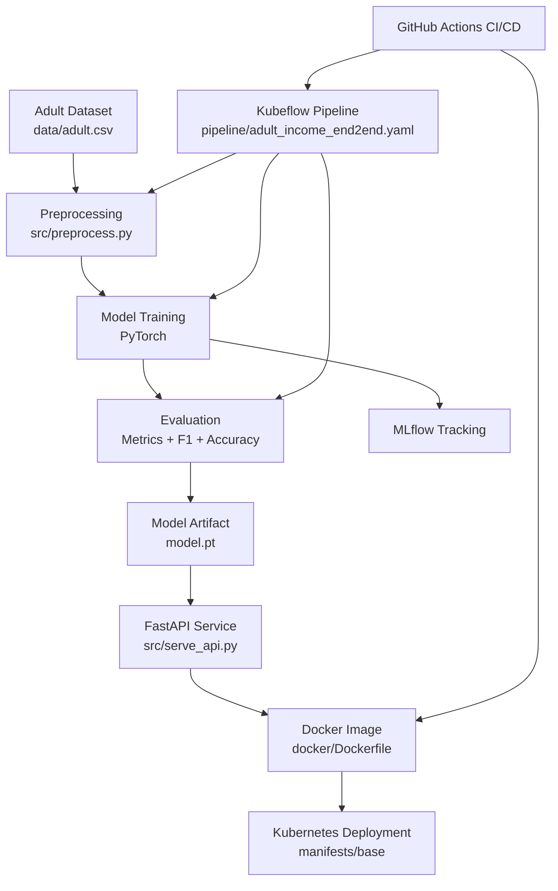
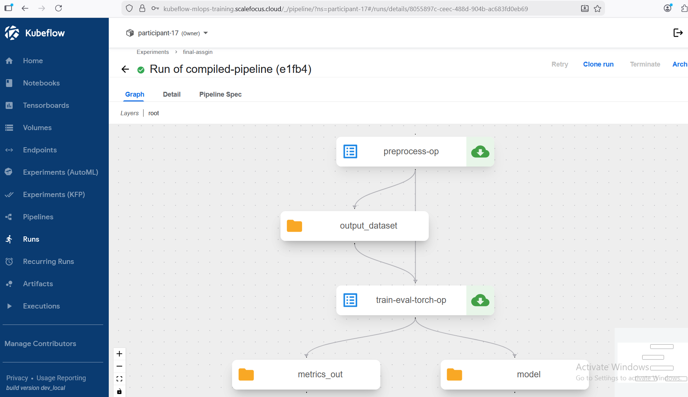
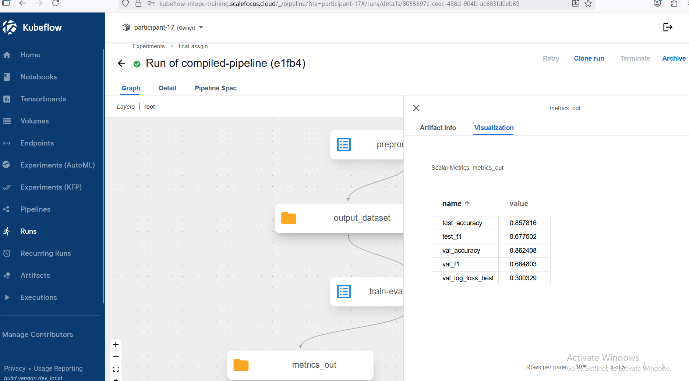
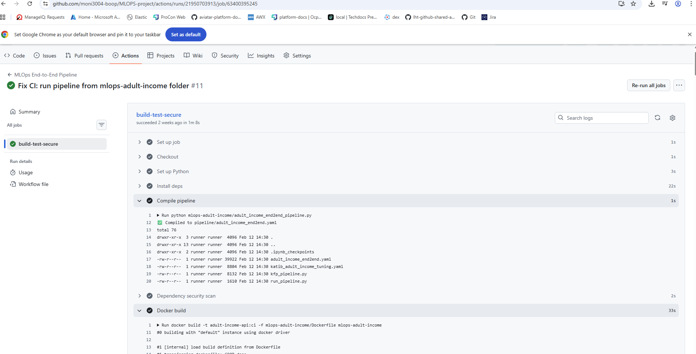

# Adult Income Classification – End-to-End MLOps Implementation

---

## Project Overview

This project presents a complete end-to-end MLOps implementation built around the **Adult Income dataset**.

The objective is to predict whether a person earns more than $50K per year using demographic and employment-related features.

The solution covers the full machine learning lifecycle:

- Data preprocessing  
- Model training with PyTorch  
- Experiment tracking with MLflow  
- Pipeline orchestration with Kubeflow  
- Optional hyperparameter tuning with Katib  
- Model serving with FastAPI  
- Kubernetes deployment  
- CI/CD automation with GitHub Actions  

The focus of this repository is not only model accuracy, but reproducibility, automation, and deployment readiness.

---

## Dataset

Dataset: UCI Adult Income Dataset  
Type: Tabular binary classification  

Target variable:
- `>50K`
- `<=50K`

Main features include:
- Age  
- Education  
- Occupation  
- Hours per week  
- Marital status  
- Capital gain / loss  

Dataset file:

```
data/adult.csv
```

---

## System Architecture

The solution is organized into independent but connected layers:

1. **Data Layer** – raw dataset and preprocessing logic  
2. **Training Layer** – PyTorch model training and evaluation  
3. **Tracking Layer** – MLflow experiment logging  
4. **Orchestration Layer** – Kubeflow Pipeline automation  
5. **Serving Layer** – FastAPI inference API  
6. **Infrastructure Layer** – Kubernetes manifests with environment overlays  
7. **Automation Layer** – GitHub Actions CI pipeline  

### Architecture Diagram

## System Architecture



---

## Repository Structure

```
.
├── data/                 # Dataset
├── src/                  # Training and serving logic
├── pipeline/             # Kubeflow & Katib definitions
├── manifests/            # Kubernetes manifests
│   ├── base/
│   └── overlays/
├── docker/               # Docker build files
├── .github/workflows/    # CI pipeline
├── requirements.txt
└── README.md
```

---

## Model Design

A feed-forward neural network implemented in PyTorch.

Model characteristics:

- Encoded tabular input features  
- Hidden layer with ReLU activation  
- Output layer for binary classification  

Loss Function:
- CrossEntropyLoss  

Optimizer:
- Adam  

Implementation:

```
src/train_pytorch.py
```

---

## Model Performance

Final evaluation on the test set:

- Accuracy: **0.86**
- F1 Score: **0.84**
- Validation Log Loss: **0.31**


### Training Metrics


---

## Experiment Tracking (MLflow)

MLflow is integrated to log:

- Hyperparameters  
- Training metrics  
- Model artifacts  
- Experiment history  

This enables model comparison and reproducibility.



---

## Kubeflow Pipeline

The ML workflow is automated using Kubeflow Pipelines.

Pipeline stages:

1. Preprocessing  
2. Training  
3. Evaluation  
4. Artifact generation  

Pipeline definition:

```
pipeline/adult_income_end2end.yaml
```

Pipeline SDK implementation:

```
pipeline/kfp_pipeline.py
```

### Completed Pipeline Run



---

## Hyperparameter Tuning (Katib Integration)

An experimental integration with Kubeflow Katib is included.

Parameters explored:

- Learning rate  
- Hidden layer size  

Katib configuration:

```
pipeline/katib_success.yaml
```

The tuning component demonstrates automated experimentation within Kubernetes.


---

## Model Serving

The trained model is exposed through a FastAPI service.

Implementation:

```
src/serve_api.py
```

Available endpoints:

- `GET /health`
- `GET /metrics`
- `POST /predict`

### Running API Example


---

## Containerization

The API service is containerized using Docker.

Dockerfiles:

```
docker/Dockerfile
docker/Dockerfile.kfp
```

This ensures consistent runtime environments across deployments.

---

## Kubernetes Deployment

Base manifests:

```
manifests/base/
```

Environment overlays:

```
manifests/overlays/microk8s/
manifests/overlays/gke/
```

The use of Kustomize allows deployment across different Kubernetes environments without modifying core manifests.

---

## CI/CD Automation

GitHub Actions pipeline:

```
.github/workflows/mlops.yml
```

CI workflow includes:

- Dependency installation  
- Pipeline compilation  
- Docker image build  
- Artifact packaging  

### CI Execution



---

## Monitoring & Retraining

Monitoring is performed through:

- MLflow experiment history  
- Pipeline metrics  
- API health and metrics endpoints  

Retraining can be triggered by:

- Manual pipeline execution  
- Performance degradation  
- New hyperparameter search  

---

## Reproducibility Practices

This project follows MLOps best practices:

- Fixed random seeds  
- Versioned pipeline definitions  
- Containerized components  
- Separation of training, serving, and infrastructure  
- Explicit artifact handling  

---

## Running the Project Locally

Install dependencies:

```
pip install -r requirements.txt
```

Train locally:

```
python src/train.py
```

Run API:

```
uvicorn src.serve_api:app --reload
```

Deploy to Kubernetes:

```
kubectl apply -k manifests/base
```

---

## Conclusion

This repository demonstrates a complete machine learning lifecycle:

- Data preparation  
- Model training  
- Experiment tracking  
- Pipeline orchestration  
- Hyperparameter tuning  
- Model serving  
- CI/CD automation  
- Kubernetes deployment  

The implementation emphasizes automation, reproducibility, and deployment readiness rather than focusing solely on model accuracy.