# Adult Income Classification – End-to-End MLOps Implementation

---

## Project Overview

This project presents a complete end-to-end MLOps implementation built around the **Adult Income dataset**.

The objective is to predict whether a person earns more than $50K per year using demographic and employment-related features.

The solution covers the full machine learning lifecycle:

- Data preprocessing  
- Model training with PyTorch  
- Experiment tracking with MLflow  
- Pipeline orchestration with Kubeflow  
- Optional hyperparameter tuning with Katib  
- Model serving with FastAPI  
- Kubernetes deployment  
- CI/CD automation with GitHub Actions  

The focus of this repository is not only model accuracy, but reproducibility, automation, and deployment readiness.

---

## Dataset

Dataset: UCI Adult Income Dataset  
Type: Tabular binary classification  

Target variable:
- `>50K`
- `<=50K`

Main features include:
- Age  
- Education  
- Occupation  
- Hours per week  
- Marital status  
- Capital gain / loss  

Dataset file:

```
data/adult.csv
```

---

## System Architecture

The solution is organized into independent but connected layers:

1. **Data Layer** – raw dataset and preprocessing logic  
2. **Training Layer** – PyTorch model training and evaluation  
3. **Tracking Layer** – MLflow experiment logging  
4. **Orchestration Layer** – Kubeflow Pipeline automation  
5. **Serving Layer** – FastAPI inference API  
6. **Infrastructure Layer** – Kubernetes manifests with environment overlays  
7. **Automation Layer** – GitHub Actions CI pipeline  

### Architecture Diagram


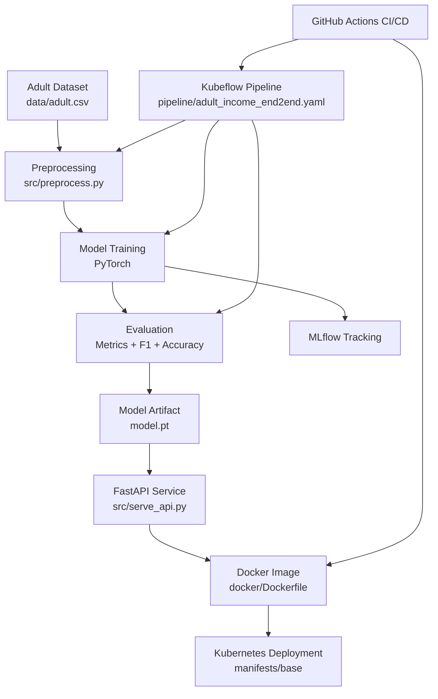

---

## Repository Structure

```
.
├── data/                 # Dataset
├── src/                  # Training and serving logic
├── pipeline/             # Kubeflow & Katib definitions
├── manifests/            # Kubernetes manifests
│   ├── base/
│   └── overlays/
├── docker/               # Docker build files
├── .github/workflows/    # CI pipeline
├── requirements.txt
└── README.md
```

---

## Model Design

A feed-forward neural network implemented in PyTorch.

Model characteristics:

- Encoded tabular input features  
- Hidden layer with ReLU activation  
- Output layer for binary classification  

Loss Function:
- CrossEntropyLoss  

Optimizer:
- Adam  

Implementation:

```
src/train_pytorch.py
```

---

## Model Performance

Final evaluation results obtained from the completed Kubeflow pipeline run.

### Test Set Performance

- **Test Accuracy:** 0.8578  
- **Test F1 Score:** 0.8775  

These metrics represent the final generalization performance of the trained model.

### Validation Performance

- **Validation Accuracy:** 0.8642  
- **Validation F1 Score:** 0.8648  
- **Best Validation Log Loss:** 0.3003  

Validation metrics were used during training to monitor convergence and prevent overfitting.

### Interpretation

The model achieves balanced classification performance with:

- Strong generalization (high test F1 score)  
- Stable validation behavior  
- Low validation log loss  

This indicates that the model is neither underfitting nor significantly overfitting the dataset.


---

## Experiment Tracking (MLflow)

MLflow is integrated to log:

- Hyperparameters  
- Training metrics  
- Model artifacts  
- Experiment history  

This enables model comparison and reproducibility.

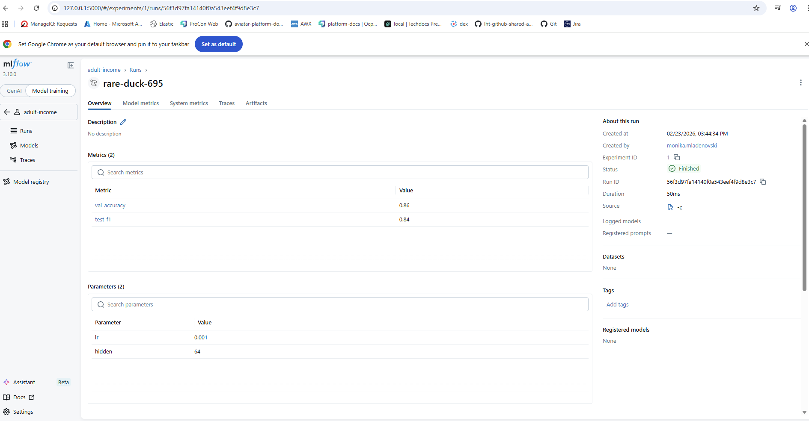

---

## Kubeflow Pipeline

The ML workflow is automated using Kubeflow Pipelines.

Pipeline stages:

1. Preprocessing  
2. Training  
3. Evaluation  
4. Artifact generation  

Pipeline definition:

```
pipeline/adult_income_end2end.yaml
```

Pipeline SDK implementation:

```
pipeline/adult_income_end2end_pipeline.py
```

### Completed Pipeline Run


---

### Hyperparameter Tuning (Katib - Experimental)

## Overview

This project integrates **Kubeflow Katib** for automated hyperparameter optimization inside Kubernetes.

Katib creates trial Kubernetes Jobs and automatically injects a **File Metrics Collector** container into each trial pod.

The training container writes evaluation metrics in **TEXT format** to:
/mnt/katib/metrics


Katib reads these metrics and optimizes the objective function.

---

## Objective Configuration

- **Objective metric:** `val_log_loss_best`
- **Optimization goal:** Minimize
- **Additional metrics:**
  - `val_accuracy`
  - `val_f1`
  - `test_accuracy`
  - `test_f1`
- **Metrics collector type:** File
- **Metrics format:** TEXT

---

## Trial Pod Architecture

Each trial pod contains two containers:

1. `training-container`
2. `metrics-logger-and-collector` (automatically injected by Katib)

The training container generates model metrics, while the collector parses and forwards them to Katib for optimization.

---

## Metrics Format Example

Example content of `/mnt/katib/metrics`:
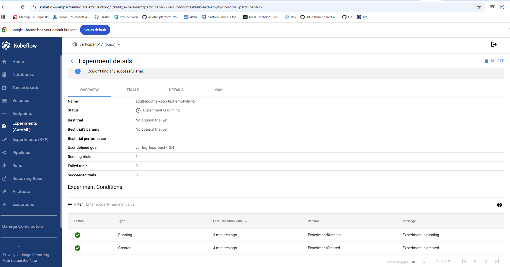
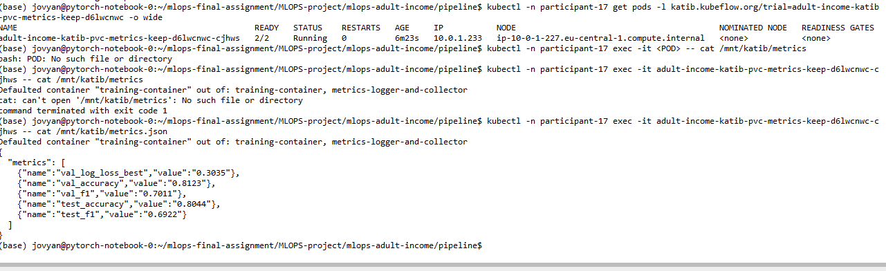


---

## Model Serving

The trained model is exposed through a FastAPI service.

Implementation:

```
src/serve_api.py
```

Available endpoints:

- `GET /health`
- `GET /metrics`
- `POST /predict`

### Results


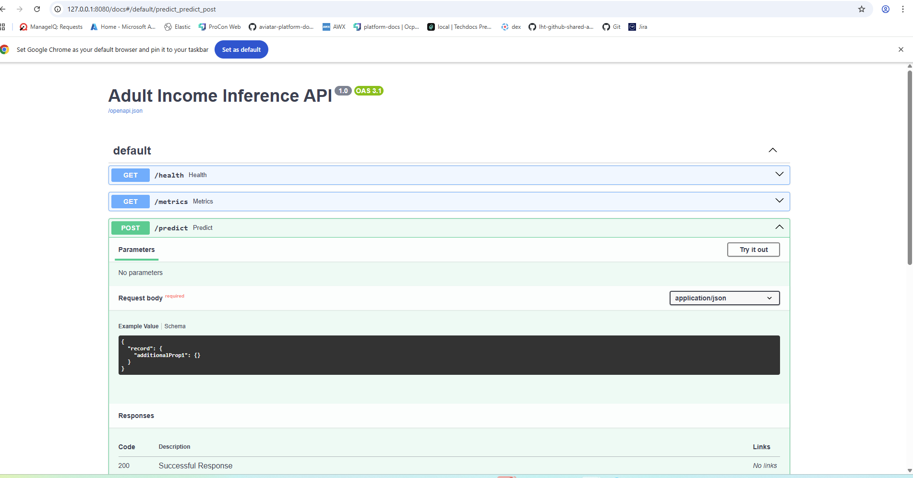

---

## Containerization

The API service is containerized using Docker.

Dockerfiles:

```
docker/Dockerfile
docker/Dockerfile.kfp
```

This ensures consistent runtime environments across deployments.

---

## Kubernetes Deployment

Base manifests:

```
manifests/base/
```

Environment overlays:

```
manifests/overlays/microk8s/
manifests/overlays/gke/
```

The use of Kustomize allows deployment across different Kubernetes environments without modifying core manifests.

---
---

## Multi-Cloud Portability

The solution is validated on two different environments with minimal changes, using Kubernetes manifests and Kustomize overlays.

### Platform A (Cloud)
- **AWS-hosted Kubeflow** (namespace: `participant-17`)
- Evidence: successful Kubeflow pipeline execution and artifacts (see pipeline screenshots)

### Platform B (Local)
- **Minikube (Docker driver) on Windows**
- Deployed the same FastAPI serving component and verified it via `/health` endpoint
- Evidence:
  - `kubectl get nodes` (Minikube cluster ready)
  - `kubectl -n participant-17 get pods/svc` (workloads running)
  - `curl http://localhost:8000/health` returns `{"status":"ok"}`

Screenshots:
- 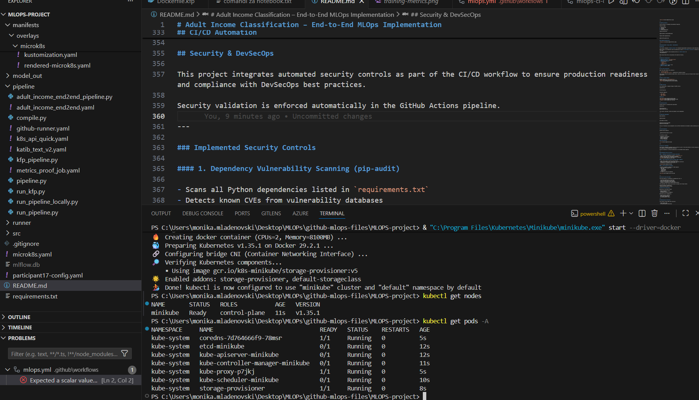
- 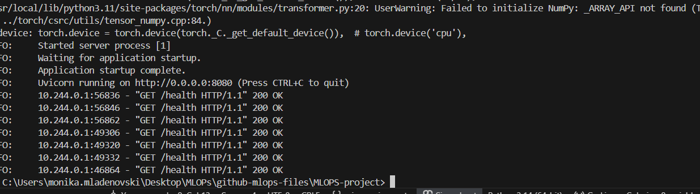
- 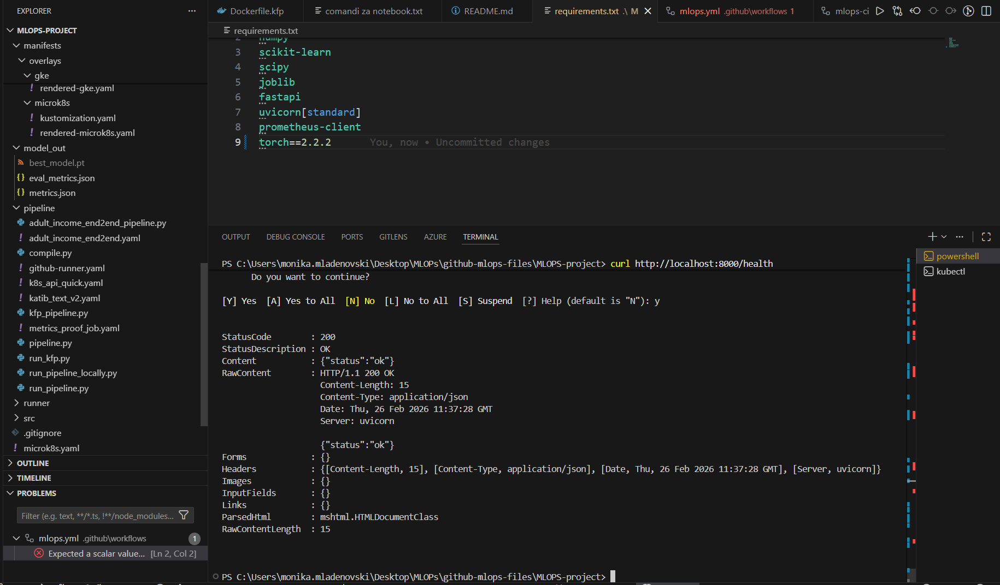

### Portability Notes

- Core application code and container image remain unchanged
- Only platform-specific configuration differs (local vs cloud ingress/storage/cluster access)
- Serving is validated consistently across both environments using the same API endpoints

## CI/CD Automation

GitHub Actions pipeline:

```
.github/workflows/mlops-ci-cd.yml
```

CI workflow includes:

- Dependency installation  
- Pipeline compilation  
- Docker image build  
- Artifact packaging  

### CI/CD Execution

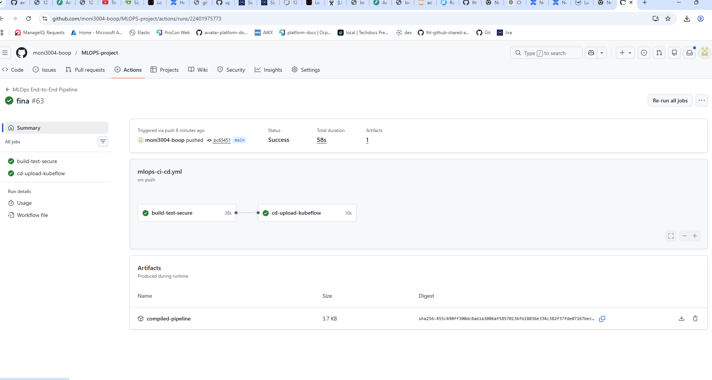

---
---

## Security & DevSecOps

This project integrates automated security controls as part of the CI/CD workflow to ensure production readiness and compliance with DevSecOps best practices.

Security validation is enforced automatically in the GitHub Actions pipeline.

---

### Implemented Security Controls

#### 1. Dependency Vulnerability Scanning (pip-audit)

- Scans all Python dependencies listed in `requirements.txt`
- Detects known CVEs from vulnerability databases
- CI fails automatically if vulnerabilities are detected
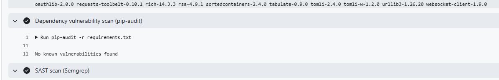

#### 2. Static Application Security Testing (SAST – Semgrep)

- Scans source code for insecure coding patterns
- Detects misconfigurations, unsafe calls, and risky constructs
- Configured as a blocking security gate in CI

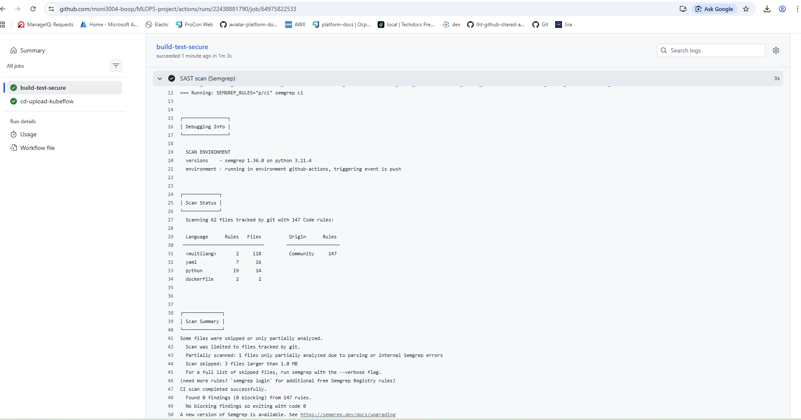

#### 3. Secret Detection (Gitleaks)

- Prevents accidental credential or token exposure
- Scans repository content for:
  - API keys
  - Private keys
  - Access tokens
  - Passwords
- CI fails if secrets are detected


---

### Security Gate Enforcement

The CI/CD pipeline is configured to automatically fail if:

- Vulnerable dependencies are detected
- Static analysis finds blocking issues
- Secrets are committed to the repository


This guarantees that insecure code cannot be merged into the main branch.

Security workflow configuration:
.github/workflows/mlops-ci-cd.yml

## Monitoring & Retraining

Monitoring is performed through:

- MLflow experiment history  
- Pipeline metrics  
- API health and metrics endpoints  

Retraining can be triggered by:

- Manual pipeline execution  
- Performance degradation  
- New hyperparameter search  

---

## Reproducibility Practices

This project follows MLOps best practices:

- Fixed random seeds  
- Versioned pipeline definitions  
- Containerized components  
- Separation of training, serving, and infrastructure  
- Explicit artifact handling  

---

## Running the Project Locally

Install dependencies:

```
pip install -r requirements.txt
```

Train locally:

```
python src/train_pytorch.py
```

Run API:

```
uvicorn src.serve_api:app --reload
```

Deploy to Kubernetes:

```
kubectl apply -k manifests/base
```

---

## Production Readiness

This implementation demonstrates production-oriented design principles:

- Modular and decoupled components  
- Environment-agnostic Kubernetes deployment  
- Containerized training and serving  
- Automated CI/CD pipeline  
- Explicit artifact management  
- Experiment traceability  

The architecture is designed for extensibility and portability across different Kubernetes environments.

---

## Cost Considerations

The project is designed with cost-efficiency in mind.

### Platform A (Cloud – AWS Hosted Kubeflow)

Estimated cost factors:
- Compute instances for Kubeflow
- Storage (EBS / S3)
- Network traffic

Optimization strategies:
- Use small instance types for experimentation
- Avoid long-running GPU instances
- Trigger retraining manually instead of continuous retraining
- Use lightweight container images

### Platform B (Local – Minikube)

- No cloud cost
- Uses local Docker runtime
- Ideal for development and validation

This hybrid approach allows experimentation in cloud environments while maintaining low development costs locally.

## Conclusion

This repository demonstrates a complete machine learning lifecycle:

- Data preparation  
- Model training  
- Experiment tracking  
- Pipeline orchestration  
- Hyperparameter tuning  
- Model serving  
- CI/CD automation  
- Kubernetes deployment  

The implementation emphasizes automation, reproducibility, and deployment readiness rather than focusing solely on model accuracy.