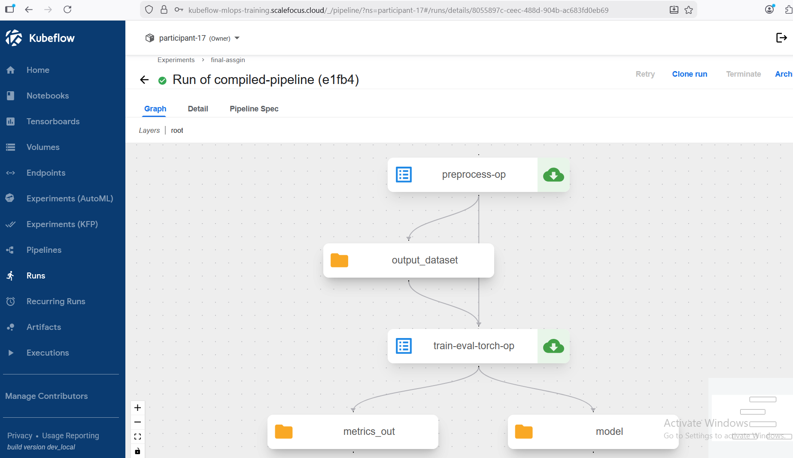
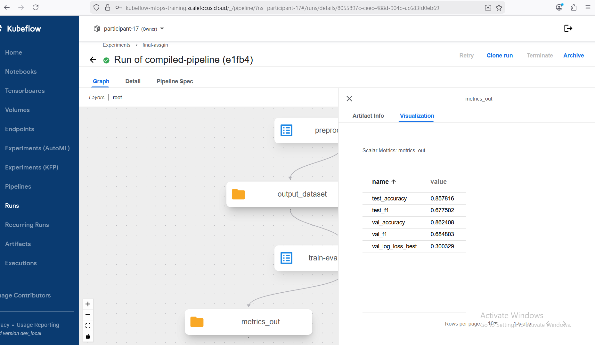
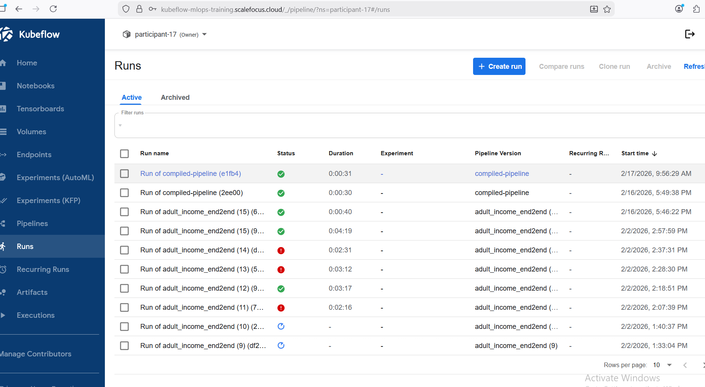
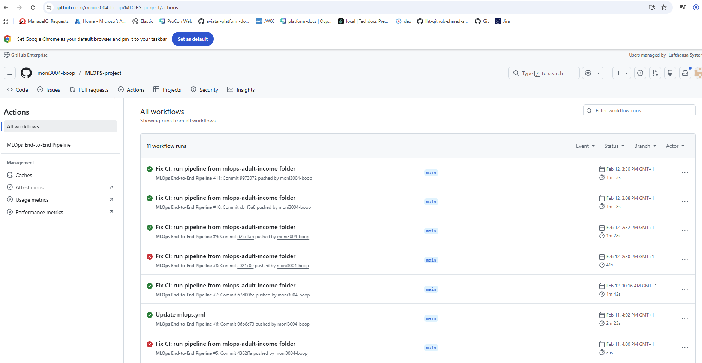

# Adult Income MLOps Project

This project implements a complete end-to-end MLOps solution using the Adult Income (UCI Census Income) dataset.  
The objective is to predict whether an individual earns more than $50K per year based on demographic and employment-related features.

The solution includes:

- Data preprocessing
- PyTorch model training
- Hyperparameter tuning with Kubeflow Katib
- MLflow experiment tracking
- Model serving with FastAPI
- Kubernetes deployment
- CI/CD with GitHub Actions
- DevSecOps validation
- Multi-cloud portability using Kustomize overlays
- Monitoring and retraining strategy

---

# 1. Dataset

The project uses the **Adult Income dataset**, a real-world tabular dataset.

The dataset contains attributes such as:

- Age  
- Education  
- Occupation  
- Hours per week  
- Marital status  
- Capital gain/loss  

Target variable:
- Income > 50K  
- Income <= 50K  

Dataset file:
```
data/adult.csv
```

---

# 2. Model Architecture

A feed-forward neural network was implemented using PyTorch.

Architecture:
- Input layer (encoded features)
- Hidden layer with ReLU activation
- Output layer for binary classification

Loss Function:
- CrossEntropyLoss  

Optimizer:
- Adam  

Model implementation:
```
src/train_pytorch.py
```

---

# 3. Training & Evaluation

The model was trained using PyTorch and tracked using MLflow.

Key evaluation metrics:
- Validation Accuracy
- Test Accuracy
- F1 Score
- Validation Log Loss





Generated artifacts:
- model.pt
- best_model.pt
- metrics.json
- preprocessor.joblib
- MLflow logs

Artifacts stored in:
```
model_out/
artifacts/
mlruns/
```

---

# 4. End-to-End Kubeflow Pipeline

The project implements a complete Kubeflow Pipeline automating the ML workflow.

Pipeline Steps:

1. Preprocessing  
   - Data cleaning and encoding  
   - Train/validation/test split  
   - Preprocessor artifact generation  

2. Training & Evaluation  
   - PyTorch model training  
   - Metric computation (Accuracy, F1, Log Loss)  
   - Model artifact storage  

3. Hyperparameter Tuning (Katib)  
   - Learning rate optimization  
   - Hidden layer size optimization  
   - Best parameter selection  
   - Tuning results stored as artifacts  

4. Artifact Output  
   - Model  
   - Metrics  
   - Dataset outputs  

Pipeline definition:
```
pipeline/adult_income_end2end.yaml
```

Pipeline SDK implementation:
```
pipeline/kfp_pipeline.py
```

Successful pipeline execution:



---

# 5. Model Serving

The trained model is exposed via a FastAPI application.

Serving implementation:
```
src/serve_api.py
```

Endpoints:

- GET /health  
- GET /metrics  
- POST /predict  

Kubernetes manifests:
```
manifests/base/
```

---
TUKA SLIKI 

# 6. CI/CD & DevSecOps

A full CI/CD pipeline is implemented using GitHub Actions.

Workflow file:
```
.github/workflows/mlops.yml
```

Automated steps:

- Code checkout  
- Dependency installation  
- Pipeline compilation  
- Docker image build  
- Artifact upload  
- Security validation  

Successful CI execution:



The compiled pipeline artifact is uploaded automatically:
```
compiled-pipeline.zip
```

---

# 7. Dockerization

The model serving API is containerized using Docker.

Dockerfile:
```
Dockerfile
```

The Docker image is built automatically during CI execution.

---

# 8. Monitoring

Monitoring is implemented at multiple levels:

1. Kubeflow Pipeline Monitoring  
   - Validation Accuracy  
   - F1 Score  
   - Log Loss  

2. MLflow Experiment Tracking  
   - Model versioning  
   - Metric history  
   - Artifact logging  

3. Serving-Level Monitoring  
   - /health endpoint  
   - /metrics endpoint  

Metrics example:


---

# 9. Retraining Strategy

To maintain long-term model performance, retraining is supported.

Retraining can be triggered by:

- Manual pipeline re-execution  
- Performance degradation threshold (e.g., val_accuracy < 0.80)  
- Scheduled runs (optional configuration)  

Pipeline re-triggering:
```
run_pipeline.py
```

Manual retraining via Kubeflow "Clone run":


---

# 10. Multi-Cloud Deployment

The solution supports deployment across multiple Kubernetes platforms using Kustomize overlays.

Common base configuration:
```
manifests/base/
```

Platform-specific overlays:

MicroK8s → Service type NodePort  
```
manifests/overlays/microk8s/
```

GKE → Service type LoadBalancer  
```
manifests/overlays/gke/
```

Rendered verification:

MicroK8s:
```
type: NodePort
```

GKE:
```
type: LoadBalancer
```

This demonstrates infrastructure portability across different Kubernetes environments.
SLIKA

---

# 11. Architecture Overview

The system architecture consists of:

- Data Layer (Adult dataset)  
- Preprocessing Component  
- Training Component (PyTorch)  
- Hyperparameter Tuning (Katib)  
- Experiment Tracking (MLflow)  
- Model Serving (FastAPI)  
- Containerization (Docker)  
- Orchestration (Kubernetes)  
- CI/CD (GitHub Actions)  
- Multi-Cloud Deployment (Kustomize overlays)  

---

# 12. Cost & Infrastructure Considerations

The solution is designed to run on:

- Local Kubernetes (MicroK8s)  
- Managed Kubernetes (GKE)  

Cost factors include:

- Compute resources for training  
- Kubernetes cluster runtime  
- Container registry storage  
- Artifact storage  

Using local Kubernetes reduces infrastructure costs during development.

---

# 13. Security Considerations

Security best practices applied:

- Isolated virtual environment  
- Dependency management via requirements.txt  
- CI pipeline validation  
- Container-based deployment  
- Namespace isolation in Kubernetes  

---

# Conclusion

This project demonstrates a fully functional end-to-end MLOps solution including:

- Real-world dataset usage  
- PyTorch model training  
- Kubeflow Pipeline orchestration  
- Katib hyperparameter tuning  
- MLflow experiment tracking  
- Model serving with FastAPI  
- CI/CD automation  
- Multi-cloud Kubernetes deployment  
- Monitoring and retraining strategy  


## Pipeline Architecture

```mermaid
flowchart TD
    A[Preprocessing Step] --> B[Train & Evaluate Model]
    B --> C[Model Artifact (.pt)]
    B --> D[Metrics Artifact]
    C --> E[Model Serving API]
    D --> F[Monitoring System]
```
